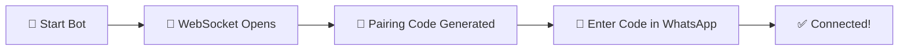

<div align="center">

# 🌟 Ovrica-V1 🌟


### 💎 **Advanced WhatsApp Bot** 💎

<p align="center">
  
  
  
  
</p>

<p align="center">
  
  
  
  
</p>

---

### 🚀 **[Installation](#-installation)** • **[Features](#-features)** • **[Commands](#-usage)** • **[Support](#-support)**

---

</div>

## 📋 **Overview**

> **Ovrica-V1** is a powerful and feature-rich WhatsApp bot built to enhance your messaging experience with cutting-edge technology and seamless integration.

<div align="center">

```ascii
╔═══════════════════════════════════════╗
║  🎯 Built for Performance             ║
║  🔐 Secured with Best Practices       ║
║  ⚡ Lightning Fast Response Times     ║
║  🎨 Highly Customizable               ║
╚═══════════════════════════════════════╝
```

</div>

## ✨ **Features**

<table>
<tr>
<td width="50%">

### 🤖 **Core Features**
- 💬 Smart automated responses
- ⚡ Lightning-fast command execution
- 🔒 Enterprise-grade security
- 📊 Advanced media handling
- 🎯 Custom command creation

</td>
<td width="50%">

### 🎨 **Advanced Features**
- 👥 Group management system
- 🌐 WebSocket connectivity
- 💾 Session persistence
- 🔄 Auto-reconnect capability
- 📝 Detailed logging system

</td>
</tr>
</table>

## 🚀 **Installation**

### **Prerequisites**

```bash
📦 Node.js >= 16.0.0
📦 npm or yarn
📦 Git
```

### **Setup Steps**

<details>
<summary><b>👉 Click to expand installation guide</b></summary>

**1️⃣ Clone the repository**
```bash
git clone https://github.com/kelvinagbe/Ovrica-V1.git
cd Ovrica-V1
```

**2️⃣ Install dependencies**
```bash
npm install
```

**3️⃣ Configure environment**
```bash
cp .env.example .env
# Edit .env with your configuration
```

**4️⃣ Start the bot**
```bash
npm start
```

</details>

---

## 🔌 **Pairing & Connection**

> 🎯 Ovrica-V1 uses **WebSocket** technology for secure and fast pairing

<div align="center">

### **🔗 Connection Process**



</div>

### **📋 Step-by-Step Guide**

<table>
<tr>
<td width="5%">1️⃣</td>
<td width="95%">

**Start the bot**
```bash
npm start
```
</td>
</tr>
<tr>
<td>2️⃣</td>
<td>

**Watch the terminal** - A WebSocket connection will be established and a pairing code will be displayed
```
🔗 WebSocket Connected
🔢 Your Pairing Code: XXXX-XXXX
```
</td>
</tr>
<tr>
<td>3️⃣</td>
<td>

**Open WhatsApp** on your phone
- Go to **⚙️ Settings** → **📱 Linked Devices**
- Tap **🔗 Link a Device**
- Select **📞 Link with phone number instead**
</td>
</tr>
<tr>
<td>4️⃣</td>
<td>

**Enter the pairing code** shown in your terminal
</td>
</tr>
<tr>
<td>5️⃣</td>
<td>

**Success!** ✅ Your bot is now connected and ready
```
✅ Successfully Connected!
🤖 Ovrica-V1 is now active
```
</td>
</tr>
</table>

### **🎯 Connection Features**

<div align="center">

| Feature | Description |
|---------|-------------|
| 🚫 **No QR Code** | Direct pairing code method |
| 🔌 **WebSocket** | Secure and fast protocol |
| 🔄 **Auto Reconnect** | Maintains stable connection |
| 💾 **Session Saved** | Stays logged in after restart |

</div>

---

## 📖 **Usage**

### **🎮 Basic Commands**

<div align="center">

| Command | Description | Example |
|---------|-------------|---------|
| `!help` | 📚 Display all commands | `!help` |
| `!ping` | 🏓 Check response time | `!ping` |
| `!info` | ℹ️ Get bot information | `!info` |
| `!menu` | 📋 Show command menu | `!menu` |
| `!status` | 📊 Check bot status | `!status` |

</div>

### **⚙️ Configuration**

Edit `config.js` to customize:

```javascript
{
  prefix: '!',           // 🎯 Command prefix
  botName: 'Ovrica-V1',  // 🤖 Bot name
  owner: 'YourName',     // 👤 Owner info
  autoRead: true,        // 📖 Auto-read messages
  selfReply: false       // 💬 Reply to own messages
}
```

---

## 🛠️ **Development**

### **📁 Project Structure**

```
🌳 Ovrica-V1/
├── 📂 assets/           # 🖼️ Images and media files
├──          # ⚡ Command modules
├── 📂            # ⚙️ Configuration files
├── 📂 utils/         # 🎯 Event handlers
├── 📂 lib/              # 🔧 Utility functions
├── 📂 node_modules/     # 📦 Dependencies
├── 📄 .env              # 🔐 Environment variables
├── 📄 .gitignore        # 🚫 Git ignore file
├── 📄 config.js         # ⚙️ Main configuration
├── 📄 index.js          # 🚀 Entry point
├── 📄 package.json      # 📦 Project metadata
└── 📄 README.md         # 📖 Documentation
```

### **➕ Adding New Commands**

Create a new file in `commands/` directory:

```javascript
module.exports = {
  name: '✨ commandname',
  category: '📚 category',
  description: '📝 Command description',
  usage: '💡 !commandname <args>',
  
  execute: async (client, message, args) => {
    // 🎯 Your command logic here
    await message.reply('✅ Command executed!');
  }
};
```

---

## 🤝 **Contributing**

<div align="center">

### **We 💜 Contributions!**

Contributions make the open-source community amazing. Any contributions are **greatly appreciated**!

</div>

**🔧 How to Contribute:**

1. 🍴 Fork the repository
2. 🌿 Create your feature branch
   ```bash
   git checkout -b feature/AmazingFeature
   ```
3. 💾 Commit your changes
   ```bash
   git commit -m '✨ Add some AmazingFeature'
   ```
4. 📤 Push to the branch
   ```bash
   git push origin feature/AmazingFeature
   ```
5. 🎉 Open a Pull Request

---

## 📝 **License**

<div align="center">

This project is licensed under the **MIT License**

See [LICENSE](LICENSE) for more information

[](https://opensource.org/licenses/MIT)

</div>

---

## 👨‍💻 **Author**

<div align="center">

### **Kelvin Agbe** 👨‍💻

[](https://github.com/kelvinagbe)
[](https://github.com/kelvinagbe/Ovrica-V1)
[](https://wa.me/yourphonenumber)

</div>

---

## 🙏 **Acknowledgments**

<div align="center">

💚 Thanks to the **WhatsApp Web.js** community

⭐ All **contributors** who help improve this project

🎯 Open source **libraries** that made this possible

</div>

---

## 📞 **Support**

<div align="center">

### **Need Help?** 🤔

[](https://github.com/kelvinagbe/Ovrica-V1/issues)
[](https://chat.whatsapp.com/yourlink)
[](https://t.me/yourhandle)

</div>

---

## ⚠️ **Disclaimer**

<div align="center">

> ⚡ This bot is **not affiliated** with WhatsApp or Meta.
> 
> 📜 Use at your own risk. Comply with WhatsApp's Terms of Service.
> 
> 🔒 Always respect user privacy and data protection laws.

</div>

---

## 🔄 **Updates & Changelog**

<div align="center">

### **Stay Updated!** 📣

⭐ Star this repository • 👀 Watch for releases • 📢 Follow for updates

</div>

<details>
<summary><b>📋 Version History</b></summary>

### **v1.0.0** (Current)
- ✅ Initial release
- ✅ WebSocket pairing system
- ✅ Core command system
- ✅ Group management features
- ✅ Auto-reconnect functionality

</details>

---

<div align="center">

### 💖 **Made with Love by Ovrica-V1 Team** 💖

```ascii
╔══════════════════════════════════════╗
║                                      ║
║     ⭐ Star us on GitHub! ⭐        ║
║                                      ║
║   Thank you for using Ovrica-V1!    ║
║                                      ║
╔══════════════════════════════════════╝
```

**[⬆ Back to Top](#-ovrica-v1-)**

---


</div>